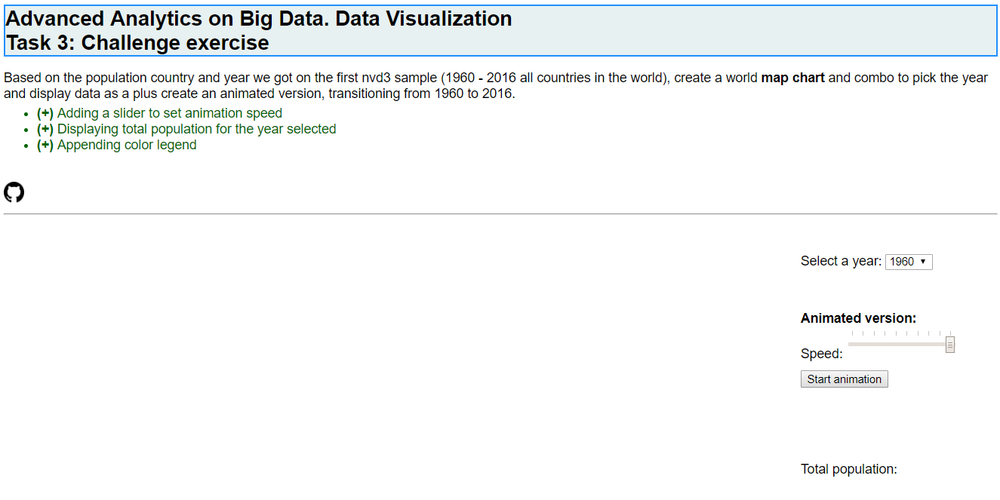
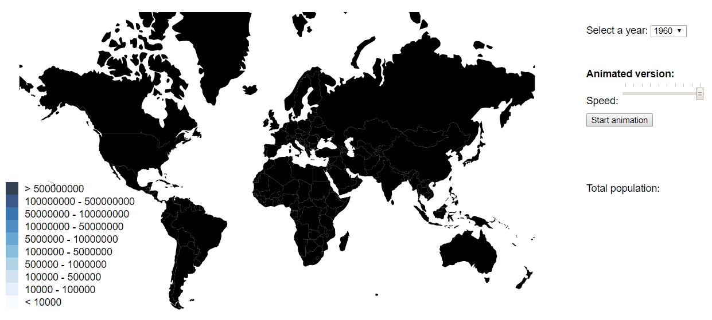
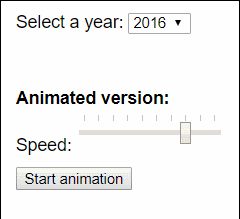
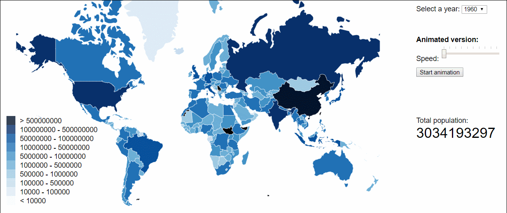

# D3js_ChallengeTask_MasterBigData
Third task for Data Visualization module from master "Advanced Analytics on Big Data"

This task consists on displaying a **Map chart** and a combobox to pick the year and display the data, as a plus creating an animated version, transitioning from 1960 to 2016.

Additionally, more features were included, just for learning:
- Adding a slider to set animation speed
- Displaying total world population for the year selected
- Appending color legend

Below there is an explanation on how to run and reproduce the example.

## Usage
Please follow these steps to visualize the exercise. ``nodejs`` must be previously installed in your computer in advance.
1. Move to any desired folder: ``cd <path>``.
2. Clone there git repository: ``git clone https://github.com/AAB87/D3js_ChallengeTask_MasterBigData.git``.
3. Move to folder "D3js_ChallengeTask_MasterBigData": ``cd D3js_ChallengeTask_MasterBigData``.
4. Run ``npm start`` in the console. Web page will be displayed in your browser.

## Steps to reproduce the example
### **0) Set up lite-server**
As indicated before, it is necessary to install ``nodejs`` in advance in your computer. To initialize ``npm`` project, go to the project folder and run:

``npm init``

For this task we are using a lite server. This is a npm package consisting in a lightweight development only node server that serves a web app, opens it in the browser, refreshes when html or javascript change, injects CSS changes using sockets, and has a fallback page when a route is not found. To install this feature, run the following command in the console:

``npm install lite-server --save-dev``

Then we must introduce the requested information asked in the console for ``package.json`` file, including ``lite-server`` in ``start`` script:

```json
{
  "name": "worldmapchallenge",
  "version": "1.0.0",
  "description": "Third task for Data Visualization module from Master Big Data",
  "main": "main.js",
  "scripts": {
    "start": "lite-server",
    "test": "echo \"Error: no test specified\" && exit 1"
  },
  "repository": {
    "type": "git",
    "url": "git+https://github.com/AlonsoAndradeBlazquez/D3js_ChallengeTask_MasterBigData.git"
  },
  "keywords": [
    "worldchallenge"
  ],
  "author": "Alonso Andrade Blázquez",
  "license": "MIT",
  "bugs": {
    "url": "https://github.com/AlonsoAndradeBlazquez/D3js_ChallengeTask_MasterBigData/issues"
  },
  "homepage": "https://github.com/AlonsoAndradeBlazquez/D3js_ChallengeTask_MasterBigData#readme",
  "devDependencies": {
    "lite-server": "^2.3.0"
  }
}
```
Additionally, we must include ``node-modules`` within ``.gitignore`` file in order not to push downloaded ``nodejs`` libraries to the repository.

### **1) Contents of the web page**
Firstly, layout and style of the web page is defined in ``index.html`` and ``styles.css``:

**``index.html``**
```html
<!DOCTYPE html>
<html lang="en-US">
  <head>
    <meta charset="utf-8">
    <title>M7_DataVisualization_Task3</title>
  </head>
  <body>
    <h1 class="exerciseTitle">
      Advanced Analytics on Big Data. Data Visualization<br>
      Task 3: Challenge exercise
    </h1>
    <div class="exerciseStatement">
            Based on the population country and year we got on the first nvd3 sample (1960 - 2016 all countries in the world), create a world <b>map chart</b> and combo to pick the year and display data as a plus create an animated version, transitioning from 1960 to 2016.
        <ul>
            <li class="additionalFeatures"><b>(+)</b> Adding a slider to set animation speed</li>
            <li class="additionalFeatures"><b>(+)</b> Displaying total population for the year selected</li>
            <li class="additionalFeatures"><b>(+)</b> Appending color legend</li>
        </ul>
    </div>
    <br>
    <a href="https://github.com/AlonsoAndradeBlazquez/D3js_ChallengeTask_MasterBigData.git">
      
    </a>
    <hr>
    <br>
    <div>
        <div class="leftContent"></div>
        <div class="rightContent">
            Select a year: 
            <select id="yearSelection"></select>
            <br><br>
            <div class="animation">
                <span class="animationLabel">Animated version:</span>
                <br>
                <div class="animationControls">
                    <div class="speedSlider">
                    Speed:
                    <input type="range" id="speed" value="-100" min="-1000" max="-100" step="100" list="tickmarks">
                    <datalist id="tickmarks">
                        <option value="-1000">
                        <option value="-900">
                        <option value="-800">
                        <option value="-700">
                        <option value="-600">
                        <option value="-500">
                        <option value="-400">
                        <option value="-300">
                        <option value="-200">
                        <option value="-100">
                    </datalist>
                    </div>
                    <button id="AnimatedVersion">Start animation</button>
                </div>
                <div class="yearShown">
                    <span id="animationCurrentYearLabel" hidden>Showing data from year: </span>
                    <br>
                    <span id="animationCurrentYear" class="animationCurrentYear"></span>
                </div>

                <div class="worldPopulation">
                    <span>Total population: </span>
                    <br>
                    <span id="totalPopulation" class="totalPopulation"></span>
                </div>
            </div>
            <br><br>
        </div>
    </div>
    <script src="http://d3js.org/d3.v4.min.js"></script>
    <script src="http://d3js.org/queue.v1.min.js"></script>
    <script src="http://d3js.org/topojson.v1.min.js"></script>
    <link rel="stylesheet" href="./styles.css" />
    <script src="./populationData.js"></script>
    <script src="./d3-tip.js"></script>
    <script src="./main.js"></script>
    </body>

</html>
```
Note that we divided the web in three areas using ``div``:
* Area for title (``exerciseTitle``) and exercise statement (``exerciseStatement``) including link to github repository.
* Area for map (``leftContent``), and information about the map (``rightContent``). Right side area contains also the following sub-areas:
  - ``yearSelection``: area for the combobox
  - ``animation``: area for the animation configuration
    - ``animationLabel``: for displaying animation label
    - ``animationControls``: this one includes ``speedSlider`` control and ``AnimatedVersion`` button to start the animation. Slider is added by using a ``range`` object and a ``datalist`` inside.
  - ``yearShown``: for displaying the year selected with the animation or the combobox.
  - ``worldPopulation``: for displaying world population of the selected year when animation is active.

At the end of html the necessary scripts are added:
- d3js scripts for general use of the framework and queue and topojson features.
- ``styles.css`` style sheet
- ``d3-tip.js`` file for tooltips configuration
- ``populationData.js`` data file
- ``main.js`` file

**``css``**
```css
body {
  font-family: Helvetica, Arial, sans-serif;
}

.exerciseTitle {
  color:black;
  font-size: 25px;
  font-family: helvetica;
  border:2px solid DodgerBlue;
  background-color:rgb(231, 241, 241); 
}

.exerciseStatement {
  font-family:helvetica; 
  font-size:100%;
  text-align:left;
}

ul {
  margin-top: 4px;
}

.additionalFeatures {
  color: darkgreen;
}

.gitIcon {
  width: 25px;
  height: 25px;
}

.names {
  fill: none;
  stroke: #fff;
  stroke-linejoin: round;
}

.rightContent {
  float: left;
  padding: 20px;
  height: 900px;
}

.leftContent {
  float: left;
}

.animation {
  margin-top: 30px;
}

.animationControls {
  margin-top: 5px;
}

.animationLabel{
  font-weight: bold;
}

.speedSlider {
  margin-bottom: 10px;
}

.animationCurrentYear {
  font-size: xx-large;
}

.yearShown {
  padding-top: 20px;
}

.worldPopulation {
  margin-top: 50px;
  margin-bottom: 10px;
}

.totalPopulation {
  font-size: xx-large;
}
```
Here we configured style for every class included in ``html`` and explained above.

### **2) Data to be displayed**
There are two data files for this task:
- ``world_countries.json``: this file is a ``featureCollection`` including the coordinates of the polygons to be used for displaying the world countries limits in ``geojson`` format. Below a document of this collection is shown:
```json
{"type":"Feature","properties":{"name":"Angola"},"geometry":{"type":"MultiPolygon","coordinates":[[[[16.326528,-5.87747],[16.57318,-6.622645], ..., [12.436688,-5.684304]]]]},"id":"AGO"}
```
- ``populationData.js``: this file includes population per world country from 1960 to 2016, including also total population for each year. Example for one year and country:
```json
  {
    "Country Code": "ARB",
    "Country Name": "Arab World",
    "Value": 97682294,
    "Year": 1962
  }
```
Now let's start with ``main.js`` file to configure the behavior of the map.

### **3) Initialize ``svg``**
Firstly, variables that will be used in the code are configured:
```javascript
let margin = null,
    width = null,
    height = null;
let svg = null;
let tip = null;
let path = null;
let color = null;
let yearsCombobox = null;
let selectedYear = null;
let countriesLimits = null;
let countriesCoordinates = null;
let years = null;
```
Then ``svg`` for map chart is configured:
```javascript
function setupCanvasSize() {
  margin = { top: 10, right: 10, bottom: 10, left: 10 };
  width = 960 - margin.left - margin.right;
  height = 500 - margin.top - margin.bottom;
}

function appendSvg() {
  svg = d3.select(".leftContent")
    .append("svg")
    .attr("width", width)
    .attr("height", height)
    .append("g")
    .attr("class", "map");
}
```
At this step, in the web page only html contents appear:



### **4) Setup ``path`` to represent countries limits**
Firstly, it is necessary to choose how to project a point on a sphere (e.g. the earth) to a point on a flat surface (e.g. a screen), storing this information in ``projection`` variable. Then a path generator (``geoPath``) is configured, transforming GeoJSON data into an SVG path string.
```javascript
function setupPath() {
  var projection = d3.geoMercator()
    .scale(130)
    .translate([width / 2, height / 1.5]);

  path = d3.geoPath().projection(projection);
}
```
### **5) Fill years combobox**
It is necessary to fill a combobox for the non-animated version, in order to allow user to select a specific year and display the information in the map. For this purpose, firstly a function (``getListOfYears``) is created in order to retrieve all the years included in ``populationData`` file:
```javascript
function getListOfYears() {
  // Obtain years distinct values
  var searcher = {};
  var items = populationData;
  years = [];
  
  items.forEach(function(item, index) {
    var year = item.Year;
  
    if (!(year in searcher)) {
      searcher[year] = 1;
      years.push(year);
    }
  });

  return years;
}
```
Once the years are obtained, another function is ready to fill the combobox:
```javascript
function fillYearsCombobox() {
  years = getListOfYears();

  // Fill combobox
  yearsCombobox = document.getElementById("yearSelection");
  var fragment = document.createDocumentFragment();
  years.forEach(function(year, index) {
      var opt = document.createElement("option");
      opt.innerHTML = year;
      opt.value = year;
      fragment.appendChild(opt);
  });
  yearsCombobox.appendChild(fragment);

  yearsCombobox.value = Math.min(...years);
}
```
Note that combobox is **initialized with the minimum year value, this is 1960**.
### **6) Setup map color scale**
In this function numerical scale is fitted to a color scale in order to display different colors in the map depending on the population of the country. For that purpose ``scaleThreshold`` d3 function is used, specifying the numerical domain and the range of colors. Note that number of colors must be number of population values+1 to represent also the range from 0 to the minimum value.
```javascript
function setupMapColorScale() {
  color = d3.scaleThreshold()
    .domain([10000, 100000, 500000, 1000000, 5000000, 10000000, 50000000, 100000000, 500000000])
    .range(["rgb(247,251,255)", "rgb(222,235,247)", "rgb(198,219,239)",
            "rgb(158,202,225)", "rgb(107,174,214)", "rgb(66,146,198)",
            "rgb(33,113,181)", "rgb(8,81,156)", "rgb(8,48,107)",
            "rgb(3,19,43)"]);
}
```
### **7) Setup tooltip**
For this feature, an external code was used. Three steps:
- Tooltip configuration is included in ``d3-tip.js``.
- CSS tooltip styles are added to ``styles.css``:
```diff
+  /* Tooltip CSS */
+  .d3-tip {
+    line-height: 1.5;
+    font-weight: 400;
+    font-family: "avenir next", Arial, sans-serif;
+    padding: 6px;
+    background: rgba(0, 0, 0, 0.6);
+    color: #FFA500;
+    border-radius: 1px;
+    pointer-events: none;
+  }

+  /* Creates a small triangle extender for the tooltip */
+  .d3-tip:after {
+    box-sizing: border-box;
+    display: inline;
+    font-size: 8px;
+    width: 100%;
+    line-height: 1.5;
+    color: rgba(0, 0, 0, 0.6);
+    position: absolute;
+    pointer-events: none;
+  }

+  /* Northward tooltips */
+  .d3-tip.n:after {
+    content: "\25BC";
+    margin: -1px 0 0 0;
+    top: 100%;
+    left: 0;
+    text-align: center;
+  }

+  /* Eastward tooltips */
+  .d3-tip.e:after {
+    content: "\25C0";
+    margin: -4px 0 0 0;
+    top: 50%;
+    left: -8px;
+  }

+  /* Southward tooltips */
+  .d3-tip.s:after {
+    content: "\25B2";
+    margin: 0 0 1px 0;
+    top: -8px;
+    left: 0;
+    text-align: center;
+}

+  /* Westward tooltips */
+  .d3-tip.w:after {
+    content: "\25B6";
+    margin: -4px 0 0 -1px;
+    top: 50%;
+    left: 100%;
+}


+  .details {
+    color: white;
+  }
```
- Tooltip is called in ``main.js``:
```javascript
function setupTooltip() {
  var format = d3.format(",");

  tip = d3.tip()
    .attr("class", "d3-tip")
    .offset([-10, 0])
    .html(function (d) {
      return "<strong>Country: </strong><span class='details'>" + 
              d.properties.name + 
              "<br></span>" + 
              "<strong>Population: </strong><span class='details'>" + 
              format(d.population) + 
              "</span>";
      }
    );
  
  svg.call(tip);
}
```
### **8) Append legend**
Now a color legend is added to the chart in order to interpretate the colors in the map. For this purpose, firstly we set the values for the color domain and legend labels. Then we can append the legend using rectangles to show the colors, filling the colors with the previously defined ``color`` variable. In this function, legend is also properly positioned at the left corner of the svg.
```javascript
function addLegend() {
  var ext_color_domain = [0, 10000, 100000, 500000, 1000000, 5000000, 10000000, 50000000, 100000000, 500000000];
  var legendLabels = ["< 10000",
                      "10000 - 100000",
                      "100000 - 500000",
                      "500000 - 1000000",
                      "1000000 - 5000000",
                      "5000000 - 10000000",
                      "10000000 - 50000000",
                      "50000000 - 100000000",
                      "100000000 - 500000000",
                      "> 500000000"];

  var legend = svg.selectAll("g.legend")
    .data(ext_color_domain)
    .enter().append("g")
    .attr("class", "legend")
    .attr("transform", "translate(20,470)");;

  var width = 20;
  var height = 20;

  legend.append("rect")
    .attr("x", 20)
    .attr("y", function(d, i){ return height - (i * width) - 2 * height;})
    .attr("width", width)
    .attr("height", height)
    .style("fill", function(d, i) { return color(d); })
    .style("opacity", 0.8);

  legend.append("text")
    .attr("x", 50)
    .attr("y", function(d, i){ return height - (i * height) - height - 4;})
    .text(function(d, i){ return legendLabels[i]; });
}
```
### **9) Display map**
Now that everything is configured as explained in above steps, we are able to initialize the map, displaying year 1960. For that purpose, function ``initializeMap`` has been created. 

In this funtion, firstly we set the selected year from the combobox value, and then load the list of countries (including their geo position, path). Once this call has been completed it will call a ``ready`` function explained below.

```javascript
function initializeMap() {
  selectedYear = yearsCombobox.options[yearsCombobox.selectedIndex].value

  queue()
    .defer(d3.json, "world_countries.json")
    .await(ready);
}
```
Once ``world_countries.json`` is loaded, countries limits and fill colors are drawed by using the ``path``. 
```javascript
function ready(error, data) {
  countriesCoordinates = data;

  countriesLimits = svg.append("g")
    .attr("class", "countries")
    .selectAll("path")
    .data(data.features)
    .enter()
    .append("path")
    .attr("d", path);
}
```
At this step, we are just showing html contents and countries on the screen, combobox is initialized but no data is retrieved yet for displaying it in the map (map is black-colored as shown in the picture below).



For enhacing the map with data, a non-animated and an animated version has been created:

- **NON-ANIMATED VERSION (COMBOBOX CONTROL)**
``changeYear`` function was created in order to change colors / data in the screen depending after a combobox value is selected:
```javascript
function changeYear() {
  selectedYear = yearsCombobox.options[yearsCombobox.selectedIndex].value

  setData(selectedYear);
  colorCountries();
}
```
This function call two additional ones:
  - ``setData``: here we update population data of each country for the new year selected, and also total population display.
```javascript
function setData(yearToSet) {
  var populationById = {};
  populationData
    .filter(data => data.Year === parseInt(yearToSet))
    .forEach(function(d) {
      populationById[d["Country Code"]] = d.Value; 
    });

  countriesCoordinates.features.forEach(function (d) { 
    d.population = populationById[d.id] 
  });

  setTotalPopulation(yearToSet);
}
```
Total population change is obtained by retrieving ``WLD`` value within ``population`` file:
```javascript
function setTotalPopulation(yearToSet){
  var yearTotalPopulationArray = populationData.filter(function(item) {
    return item["Country Code"] === "WLD" && item.Year === parseInt(yearToSet)
  });

  if(yearTotalPopulationArray.length > 0){
    var totalPopulation = yearTotalPopulationArray[0].Value;
    document.getElementById("totalPopulation").innerHTML = totalPopulation;
  }
}
```
  - ``colorCountries_displayTooltips``: in this function we color the countries depending on their population for the given year, and also control tooltip behavior:
```javascript
function colorCountries_displayTooltips() {
  countriesLimits
    .style("fill", function (d) { 
      return color(d.population); 
    })
    .style("stroke", "white")
    .style("stroke-width", 0.5);
    
  countriesLimits
    .on("mouseover", function (d) {
      tip.show(d);

      d3.select(this)
        .style("fill", function (d) { 
          return "#E91E63"; 
        })
        .style("stroke", "white")
        .style("stroke-width", 3);
    })

    .on("mouseout", function (d) {
      tip.hide(d);

      d3.select(this)
        .style("fill", function (d) { 
          return color(d.population); 
        })
        .style("stroke", "white")
        .style("stroke-width", 0.5);
    });
}
```
To enable above features, ``changeYear`` function is called within ``ready``:
```diff
function ready(error, data) {
  countriesCoordinates = data;

  countriesLimits = svg.append("g")
    .attr("class", "countries")
    .selectAll("path")
    .data(data.features)
    .enter()
    .append("path")
    .attr("d", path);
  
+  changeYear()
}
```
Additionaly, at the top of the code we must call ``changeYear`` function every time ``#yearSelection`` html combobox changes
```javascript
d3.select("#yearSelection").on("change", changeYear);
```
Result at this step:


- **ANIMATED VERSION**
For this feature, ``animateMap`` function was created:
```javascript
function animateMap() {
  disableControls();
  setData(years[0]);
  colorCountries_displayTooltips();

  var speed = document.getElementById("speed").value;
  animateToNextYear(0, speed*(-1));
}
```
This function is enabled every time the button for animated version (``#AnimatedVersion``) is clicked:
```javascript
d3.select("#AnimatedVersion").on("click", animateMap);
```
Firstly, once animation is activated, other controls are disabled for the user (combobox, speed selection and button itself) to give control to the animation:
```javascript
function disableControls() {
  document.getElementById("yearSelection").disabled = true;
  document.getElementById("speed").disabled = true;
  document.getElementById("AnimatedVersion").disabled = true;
}
```


Then data and colors for the first year are loaded using the previously explained ``setData`` and ``colorCountries_displayTooltips`` functions.

Now it is time to animate from year to year with the speed selected in speed scroll, using a new function, ``animateToNextYear``. Speed is read from html ``speed`` item value. Within this new function, data and colors are updated for every year, except if we reach the most recent year, when animation stops and control is returned to the user (displaying 1960). Timing is managed within this function by using setTimeout javascript function.
```javascript
function animateToNextYear(yearIndex, speed) {
  var nextYearIndex = yearIndex + 1;
  if(nextYearIndex < years.length) {
    setTimeout(function() {
      document.getElementById("animationCurrentYearLabel").hidden = false;
      document.getElementById("animationCurrentYear").innerHTML = years[nextYearIndex];
      setData(years[nextYearIndex]);
      colorCountries_displayTooltips();
      animateToNextYear(nextYearIndex, speed);
    }, speed);
  } else {
    enableControls();
    document.getElementById("animationCurrentYearLabel").hidden = true;
    document.getElementById("animationCurrentYear").innerHTML = "";
    changeYear();
  }
}
```
Controls are enabled using the following function:
```javascript
function enableControls() {
  document.getElementById("yearSelection").disabled = false;
  document.getElementById("speed").disabled = false;
  document.getElementById("AnimatedVersion").disabled = false;
}
```
Final result for animated version is as showed below:



